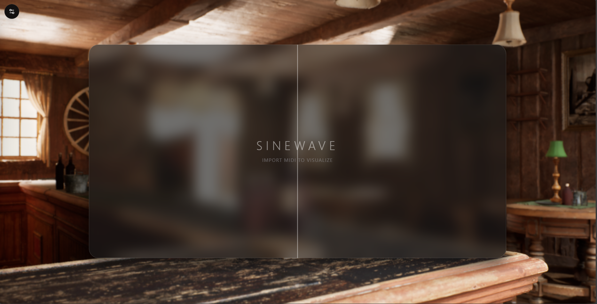

# Midi Visitor


[中文](#中文) | [English](#english)



---

## 中文

**Midi Visitor** 是一个基于 React 和 TypeScript 的浏览器端 MIDI 可视化工具，适合做录屏、演示和舞台风格的动态画面。

应用完全在浏览器中运行，不需要把文件上传到服务器。你可以导入 MIDI 文件，按需叠加外部音频，并通过背景、窗口样式、轨道过滤和波形显示来调整最终画面。

### 主要功能

- 支持纯色、线性渐变和本地图片背景。
- 支持窗口模糊、透明度、圆角、边框和阴影调节。
- 支持水平和垂直两种滚动方向。
- 支持视口边距、音符粗细、速度、音高间距和偏移控制。
- 支持轨道显示或隐藏、外部音频同步和波形叠加。

### 本地运行

```bash
git clone https://github.com/ARPO35/Midi-visitor.git
cd Midi-visitor
npm install
npm run dev
```

### 检查与测试

```bash
npm run lint
npm run build
npm run test:run
```

---

## English

**Midi Visitor** is a browser-based MIDI visualizer built with React and TypeScript for recording, demos, and stage-style motion graphics.

The app runs entirely in the browser with no server upload required. Load a MIDI file, pair it with external audio when needed, and shape the output with background, window styling, track filtering, and waveform overlay controls.

### Features

- Solid color, linear gradient, and local image backgrounds.
- Window styling with blur, opacity, radius, borders, and shadow controls.
- Horizontal and vertical scrolling modes.
- Viewport margins, note thickness, speed, pitch spacing, and offset controls.
- Track visibility toggles, external audio sync, and waveform overlay support.

### Local Development

```bash
git clone https://github.com/ARPO35/Midi-visitor.git
cd Midi-visitor
npm install
npm run dev
```

### Checks

```bash
npm run lint
npm run build
npm run test:run
```

## License

Distributed under the GNU General Public License v3.0 (GPLv3). See `LICENSE` for more information.
